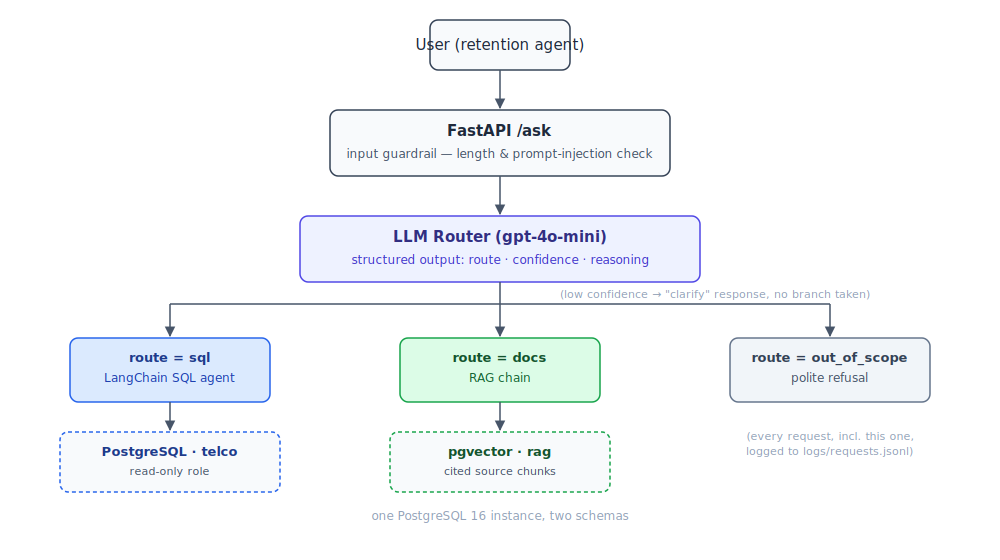

# Customer Intelligence Assistant

An AI assistant for a (fictional) telecom retention team. Agents ask plain-English
questions, and the system routes each one to whatever can actually answer it — a
SQL agent over the customer database, a RAG pipeline over internal policy PDFs, or
a refusal if it's out of scope.

Retention agents end up asking two very different kinds of questions in the same
breath: "how many customers churned on month-to-month contracts" (database) and
"how much discount can I authorize for a 2-year customer" (policy). This project
is about routing between those cleanly, keeping answers grounded in retrieved
content only, and measuring the pipeline with an offline eval harness instead of
trusting it by eye.

## Architecture



If the router isn't confident, it doesn't guess — it comes back with a clarifying
question instead. Every request (query, route, confidence, latency, answer) gets
logged to `logs/requests.jsonl`.

## Stack

Python 3.11 · FastAPI · LangChain · PostgreSQL 16 + pgvector · sentence-transformers
(local embeddings) · Docker Compose · pytest

## Project structure

```
app/
  main.py         FastAPI app: /ask endpoint, request logging, dispatch to route
  router.py       LLM router — structured output (route, confidence, reasoning)
  sql_agent.py    LangChain SQL agent + guardrail-wrapped query tool
  rag_chain.py    Embed question → pgvector similarity search → grounded answer
  guardrails.py   Input (prompt injection, length) and output (SQL, row-count) checks
ingestion/
  ingest.py       PDF → chunk (fixed or recursive) → embed → pgvector, idempotent
  load_telco.py   Load data/Telco_Customer_Churn.csv into telco.customers
evals/
  run_evals.py    Offline harness: router accuracy, retrieval hit rate, faithfulness
data/documents/   Policy PDFs (discounts, win-back, escalation, onboarding)
db/init.sql       Schemas, pgvector extension, read-only role + grants
```

## Setup

```
docker compose up -d                              # Postgres + pgvector
python -m venv .venv && .venv\Scripts\activate
pip install -r requirements.txt

# copy .env.example -> .env, add OPENAI_API_KEY

python -m ingestion.load_telco                     # load customer data
python -m ingestion.ingest --strategy recursive     # ingest policy PDFs
uvicorn app.main:app --reload
```

Re-running ingestion is safe — each PDF is deleted and re-inserted keyed on
`(source_file, chunking_strategy)`, so nothing duplicates.

## Usage

```
curl -X POST http://localhost:8000/ask \
  -H "Content-Type: application/json" \
  -d '{"question": "How much discount can an agent offer without supervisor approval?"}'
```

You get the answer, the route taken, confidence, cited sources (`docs`) or executed
queries (`sql`), and latency.

## Who'd actually use this

A few examples of who this is for and what they'd type in:

- **An agent on a call** — "how much discount can I offer a customer with 18
  months tenure on a 2-year contract without approval?" Beats hunting through
  the policy PDF while the customer's waiting, and the answer comes with the
  source file cited, so they've got something to point to if it's questioned.
- **A retention manager** — "how many month-to-month customers with no tech
  support churned this quarter?" Goes straight to the `sql` route and gets a
  number back, no need to ping a data analyst for something this small.
- **QA, after the fact** — asks the exact discount question the agent had to
  answer live, and checks the cited policy against what was actually offered.
  Same question, just used to verify instead of decide.

Basically: anyone who needs a quick answer from the policy docs or the
customer data can just ask, instead of digging through PDFs or writing SQL by
hand.

## Evaluation

```
python -m evals.run_evals --strategy recursive
```

Scores every case against what the pipeline actually did, not the expected route —
a misrouted `docs` question also fails retrieval and answer quality for that case,
instead of being excluded as N/A. Otherwise a routing bug can hide behind a
retrieval number that looks fine in isolation.

Current numbers (both chunking strategies): **100% router accuracy**, **86%
retrieval hit rate** (the one remaining miss is an intentional trap case where two
policies are genuinely easy to conflate). Recursive chunking has a small but
consistent edge on answer-quality phrasing over fixed chunking, despite identical
retrieval performance.

## Limitations

- Guardrails are regex heuristics, not formally verified — the read-only DB role
  is the real safety boundary for SQL, the guardrail is defense-in-depth on top.
- The eval dataset is small and hand-written, so accuracy numbers describe this
  dataset, not a general claim.
- Local dev setup only — no auth beyond Docker Compose defaults.
